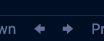

# VS Code Web Extension Powerpack

This extension pack packages powerful web development extensions for Visual Studio Code.

## Extensions Included

- [EditorConfig](https://marketplace.visualstudio.com/items?itemName=EditorConfig.EditorConfig) - EditorConfig Support for Visual Studio Code.
- [Bookmarks](https://marketplace.visualstudio.com/items?itemName=alefragnani.Bookmarks) - Mark lines and jump to them.
- [Output Colorizer](https://marketplace.visualstudio.com/items?itemName=IBM.output-colorizer) - Syntax highlighting for log files.
- [Statusbar Commands](https://marketplace.visualstudio.com/items?itemName=anweber.statusbar-commands) - Extend the statusbar with custom commands - specifically forward/back buttons.
- [Sort lines](https://marketplace.visualstudio.com/items?itemName=Tyriar.sort-lines) - Sorts lines of text.
- [ESLint](https://marketplace.visualstudio.com/items?itemName=dbaeumer.vscode-eslint) - Integrates ESLint into VS Code.
- [npm Intellisense](https://marketplace.visualstudio.com/items?itemName=christian-kohler.npm-intellisense) - Visual Studio Code plugin that autocompletes npm modules in import statements.
- [Code Outline](https://marketplace.visualstudio.com/items?itemName=patrys.vscode-code-outline) - A code outline tree provider for VSCode.

## Optional - Back/Forward buttons in statusbar



If you'd like to add back/forward buttons to your statusbar add the following to your User Settings:<br>

```
"statusbar_command.commands": [
  {
    "text": "$(arrow-right)",
    "tooltip": "Navigate forward",
    "alignment": "right",
    "command": "workbench.action.navigateForward"
  },
  {
    "text": "$(arrow-left)",
    "tooltip": "Navigate back",
    "alignment": "right",
    "command": "workbench.action.navigateBack"
  }
]
```

## Want to see your extension added?

Open a PR and I'd be happy to take a look.

**Enjoy!**
